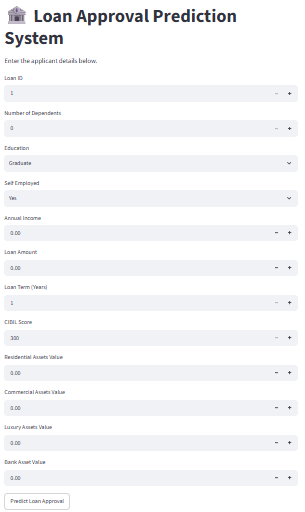
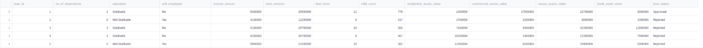
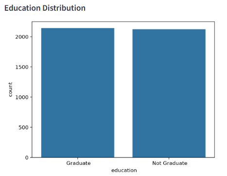
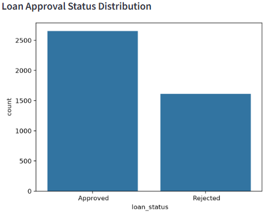
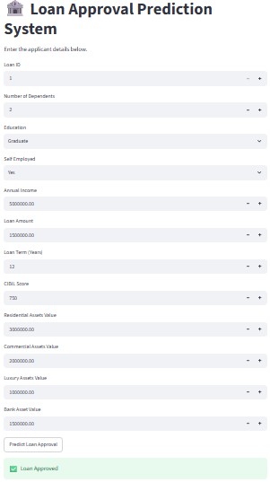
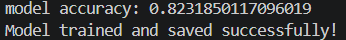

# Loan Approval Prediction System
A Machine Learning project that predicts loan approval status using Logistic Regression with an interactive Streamlit GUI.

# Project Overview
Loan Approval Prediction System is a Machine Learning project that predicts whether a loan application will be approved or rejected based on applicant details.
The project uses a Logistic Regression Machine Learning model and provides an interactive web interface using Streamlit where users can enter applicant information and get instant predictions.

# Technologies Used
- Python
- Pandas
- NumPy
- Scikit-learn
- Matplotlib
- Seaborn
- Streamlit
- Joblib

# Machine Learning Model
Algorithm Used:
**Logistic Regression**
The model is trained on a loan approval dataset. The dataset is preprocessed by converting categorical values into numerical values before training.
The trained model is saved using Joblib and used in the Streamlit application for prediction.

# Project Features
- Data preprocessing
- Exploratory data analysis
- Logistic Regression model training
- Model accuracy calculation
- Loan approval prediction
- Interactive Streamlit GUI
- Dataset preview
- Data visualization graphs

# Project Structure
Loan Approval Prediction
│
├── dataset
│ └── loan_approval_dataset.csv
│
├── images
│ ├── app_home.png
│ ├── dataset_preview.png
│ ├── graphs.png
│ └── prediction_result.png
├── loan_approval.py
├── app.py
├── loan_model.pkl
├── accuracy.pkl
├── requirements.txt
└── README.md

# Model Performance
The Logistic Regression model achieved:
Accuracy: 82.32%
The accuracy was calculated using the testing dataset after training the model.

# Application Screenshots
# Home page

# Data Preview

# Data Visualization

# Loan Prediction Result

# Model Accuracy

# How to Run the Project
Follow these steps to run the project on your system.
# Step 1: Clone the Repository
https://github.com/garimasingh026/Loan_Approval_Prediction

# Step 2: Install Required Libraries
Open the project folder in terminal and run:
pip install -r requirements.txt

# Step 3: Train the Machine Learning Model
Run:
python loan_approval.py
This will create:
- loan_model.pkl
- accuracy.pkl

# Step 4: Run Streamlit Application
Run:
python -m streamlit run app.py
The application will open in your browser.

# Working of the Project
1. The loan approval dataset is loaded using Pandas.
2. The dataset is checked for missing values and data information.
3. Categorical values such as education and employment status are converted into numerical values.
4. Features and target variables are separated.
5. The dataset is divided into training and testing data.
6. A Logistic Regression model is trained using training data.
7. Model accuracy is calculated using testing data.
8. The trained model is saved using Joblib.
9. Streamlit provides an interactive GUI for users.
10. User details are given as input and the model predicts loan approval status.

# Future Improvements
- Try other Machine Learning algorithms
- Improve prediction accuracy
- Add more user interface features
- Deploy the application online

# Author name
Garima Singh 

# Conclusion
The Loan Approval Prediction System demonstrates how Machine Learning can be used to solve real-world classification problems.
The project combines a trained Machine Learning model with a Streamlit GUI to create an interactive application.
